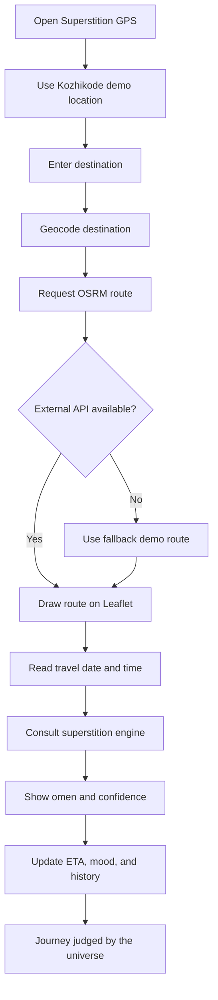

# Superstition GPS 🧿🗺️

## Basic Details

### Team Name: Cockroach

### Team Members

- Team Lead: Sharafath Ahammed V - Farook College
- Member 2: Nasih Ameen A - Farook College

### Project Description

Superstition GPS is a funny GPS-style web app where navigation decisions are controlled by omens instead of logic. It finds a route, consults the universe, and may reject the perfectly good road because a crow, Tuesday, a sneeze, or an unlucky number said so.

### The Problem (that doesn't exist)

Normal GPS apps use boring things like maps, distance, and traffic. They do not account for suspicious cats, ancestor warnings, planetary alignment, or roads that are physically open but spiritually closed.

### The Solution (that nobody asked for)

Superstition GPS adds a cosmic interference layer to navigation. It generates random omens, assigns cosmic confidence, adds imaginary delays, recalculates routes, and keeps an omen history so every journey can be judged properly.

## Technical Details

### Technologies/Components Used

For Software:

- HTML5
- CSS3
- Vanilla JavaScript
- Leaflet.js
- OpenStreetMap tiles
- OSRM public routing API
- Nominatim geocoding API
- Browser local HTTP server or GitHub Pages

For Hardware:

- No special hardware required
- Any laptop, desktop, or mobile browser
- Internet connection recommended for live maps and routing

## Implementation

### For Software

#### Installation

No package installation or API key is required.

```bash
git clone https://github.com/sharafath07/useless_project_3.0.git
cd useless_project_3.0
```

#### Run

Open `index.html` directly, or use a local server:

The app starts from Kozhikode demo coordinates so the presentation works without location permission. Place-name search and live routing use free OpenStreetMap services when available. If an external service fails, the app uses a simulated fallback route.

## Project Documentation

### Software Features

- GPS-style interactive Leaflet map
- Kozhikode demo location fallback
- Destination search by place name or latitude/longitude
- Route distance and ETA
- 18 predefined superstition events
- Random cosmic interference with no immediate repeat
- Tuesday omen based on the selected travel date
- Unlucky Number 13 when the consultation button is clicked and the date or visible route values contain `13`
- Travel date and time inputs for contextual omens
- Cosmic confidence progress bar
- Omen history
- Recalculate and demo mode
- Friendly fallback behavior when APIs are unavailable

### Screenshots

Add three screenshots from the running application to `docs/screenshots/` and update these links:


*An omen result showing cosmic confidence, route status, and a ridiculous explanation.*

### Workflow



*The application combines ordinary route calculation with a deliberately irrational superstition layer.*

## Project Demo

### Video

Add the demo video link here after recording the presentation.

Suggested demo sequence:

1. Enter a destination such as `Kozhikode`.
2. Click **Navigate** and show the ordinary route.
3. Show the generated omen and cosmic confidence.
4. Click **Consult the universe again**.
5. Set a travel date to the 13th and show **Unlucky Number 13**.
6. Click **Start demo** for the fixed Crow, Black Cat, and Tuesday sequence.

### Additional Demos

- Live app: run `index.html` or the local server command above.
- Repository: https://github.com/sharafath07/useless_project_3.0

## Team Contributions

- Sharafath Ahammed V: project concept, GPS interface, map integration, routing, and superstition engine.
- Nasih Ameen A: UI testing, demo flow, omen ideas, documentation, and presentation support.

---

Made with ❤️ at TinkerHub Useless Projects


